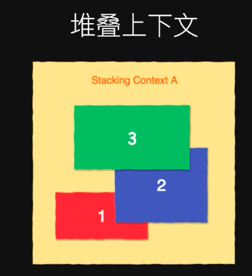
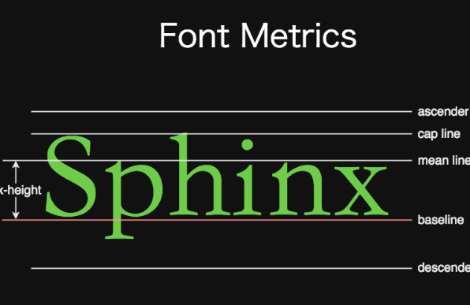
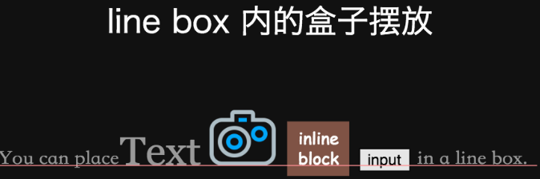
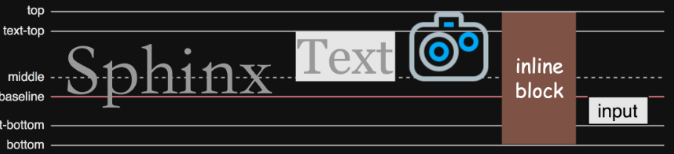

# html+css (上)

## 1 什么是前端

* web标准技术
* * html、css 、javascript、SVG、HTTP等
* 运行环境
* 界面与交互

## 2 功能
 
 
 * 安全、美观、兼容、性能、无障碍、体验

## 3 前端的边界

 * nodejs 、electron 、react、 native 、webrtc 、webgl 、webassembly

## 4 doctype的作用

 * 指定文档使用的版本和标准
 * 浏览器根据doctype决定使用那种渲染模式

## 5 语义化
 
 * HTML中的元素、属性及属性值都拥有某些含义
 * 开发者应该遵循语义来编写HTML

### 5.1 为什么语义化很重要？
 
 * 提升可读性、可维护性
 * 搜索引擎优化
 * 提升无障碍性

### 5.2 HTML的扩展

* meta
* data-*
* link
* JSON-LD

### 5.3 meta标签

```
<!-- 编码 -->
<meta charset="UTF-8">

<!-- 指定HTTP Header -->
<meta http-equiv="Content-Security-Policy"
  content="script-src 'self'">

<!-- SEO 搜索引擎优化 -->
<meta name="keywords" content="关键词">
<meta name="description" content="页面介绍">

<!-- 移动设备Viewport -->
<meta name="viewport" content="initial-scale=1">

<!-- 关闭iOS电话号码自动识别 -->
<meta name="format-detection" content="telphone=no">

<!-- 360浏览器指定内核 -->
<meta name="renderer" content="webkit">

<!-- 指定IE渲染模式 -->
<meta http-equiv="X-UA-Compatible" content="IE=edge">
data-* & dataset API
<ul>
  <li data-id="1">苹果</li>
  <li data-id="2">香蕉</li>
  <li data-id="3">芒果</li>
</ul>
link 标签 
<!-- 引入 CSS -->
<link rel="stylesheet" href="style.css">

<!-- 浏览器预加载 -->
<link rel="dns-prefetch" href="//example.com">
<link rel="prefetch" href="image.png">
<link rel="prerender" href="http://example.com">

<!-- favicon -->
<link rel="icon" type="image/png" href="myicon.png">

<!-- RSS -->
<link rel="alternate" type="application/rss+xml" href="/feed">

```
### 5.4 link标签

```
<!-- 引入 CSS -->
<link rel="stylesheet" href="style.css">

<!-- 浏览器预加载 -->
<link rel="dns-prefetch" href="//example.com">
<link rel="prefetch" href="image.png">
<link rel="prerender" href="http://example.com">

<!-- favicon -->
<link rel="icon" type="image/png" href="myicon.png">

<!-- RSS -->
<link rel="alternate" type="application/rss+xml" href="/feed">
```

### 5.5 JSON-LD

```
<script type="application/ld+json">
{
  "@context": "http://schema.org",
  "@type": "Person",
  "name": "John Doe",
  "jobTitle": "Graduate research assistant",
  "affiliation": "University of Dreams",
  "additionalName": "Johnny",
  "url": "http://www.example.com",
  "address": {
    "@type": "PostalAddress",
    "streetAddress": "1234 Peach Drive",
    "addressLocality": "Wonderland",
    "addressRegion": "Georgia"
  }
}
</script>
```
## 6 Web无障碍

* 或可访问性，Accessibility ( A11y )
* 确保任何人都有办法获取放在网页上的媒体内容
* 不让身体、心理或技术上的问题成为获取信息的障碍

## 6.1 Web 开发者应该做的事情

* [WCAG (Web Content Accessibility Guidelines)](https://www.w3.org/TR/wai-aria/)
* [ARIA (Accessible Rich Internet Applications)](https://www.w3.org/TR/wai-aria/)

### 6.2 ARIA

```
<ol role="tablist">
  <li role="tab">
    <a href="#ch1">Chapter 1</a>
  </li>
  <li role="tab">
    <a href="#ch2">Chapter 2</a>
  </li>
  <li role="tab">
    <a href="#quiz">Quiz</a>
  </li>
</ol>
```

### 6.3 提升无障碍性

* 为 img 提供 alt 属性
* noscript
* input 和 label 对应
* 图形验证码与语音验证码
* 文字和背景有足够对比度
* 键盘可操作

# html+css 下

## 1 属性选择器

```
/* 具有某个属性 */
[disabled]

/* 属性为指定的值 */
[type="checkbox"]

/* 属性值包含某个字符串 */
[href*="example"]

/* 属性值以某个字符串开头 */
[href^="http:"]

/* 属性值以某个字符串结束 */
[href$="jpg"]

/* 属性值以空格分割后包含某个字符串 */
[lang~＝"zh-cn"]
```

## 2 伪类

```
a:link    { ... }       /* 未访问过的链接 */
a:visited { ... }       /* 已访问过的链接 */

a:hover   { ... }       /* 鼠标移到链接上的样式 */
a:active  { ... }       /* 鼠标在连接上按下时的样式 */
a:focus   { ... }       /* 获得焦点时的样式 */

input:disabled { ... }  /* 禁用时的样式 */
input:checked { ... }   /* 选中时的样式 */
```

## 3 结构性伪类

```
:first-child
:last-child
:nth-child
:first-of-type
:last-of-type
:nth-of-type
:empty
```

## 4 伪元素
```
::before

::after

::first-letter

::first-line
```

```
<p>莫哈韦沙漠不仅纬度较高，而且温度要稍微低些，是命名该公园
的短叶丝兰——<a href="#">约书亚树</a>的特殊栖息地。约书亚
树以从茂密的森林到远远间隔等各种形式出现。除了约书亚树森林之
外，该公园的西部包括加州沙漠里发现的最有趣的地质外观。</p>

<style>
  p {
    line-height: 1.7
  }
  p::first-letter {
    line-height: 1.5;
    background: #F44336;
    color: #fff;
    font-size: 200%;
    float: left;
    padding: 0 0.2em;
    margin-right: 0.2em;
  }
  a::after {
    content: '⚓'
  }
</style>
```
## 5  css样式的来源

* 页面开发者
* 用户设置
* 浏览器预设

### 5.1 浏览器预设样式

* [Mozilla Firefox 预设样式](https://www.w3.org/TR/wai-aria/)
* [Google Chrome 预设样式](https://chromium.googlesource.com/chromium/blink/+/master/Source/core/css/html.css)
* [Internet Explorer 预设样式](https://www.iecss.com/)

###  5.2 哪条声明起作用？

1. 找出匹配到的该属性所有声明

2. 根据规则来源，优先级从低到高：

* 浏览器预设
* 用户设置
* 网页样式

3. 同一来源中，越特殊优先级越高

4. 特异度一样时，书写顺序在后面的优先级高

## 6 继承

某些属性会自动继承其父元素的计算值，除非显式指定一个值

```
<p>
  This is a <em>test</em> of <strong>inherit</strong>.
</p>
<style>
  p { color: #666; }
  em { color: red; }
</style>
```

### 6.1 初始值

* CSS 中，每个属性都有一个初始值
* background-color 的初始值为 transparent
* margin-left 的初始值为 0
* 可以显式重置为初始值，比如 background-color: initial

### 6.2 css求值过程

长的图画在这里。

```
<article>
  <h1>卡尔斯巴德洞窟</h1>
  <p>卡尔斯巴德洞窟（Carlsbad Caverns）是美国的一座国家公园，
  位于新墨西哥州东南部。游客可以通过天然入口徒步进入，也可以
  通过电梯直接到达230米的洞穴深处。</p>
</article>

<style>
body {
  margin: 0;
}
article {
  line-height: 150%;
}
h1 {
  font-size: 40px;
}
p {
  font-size: 14px;
}
</style>
```
### 6.3 box-sizing​​​​​​​

* 改变盒模型计算方式
* 取值：border-box | content-box
* 初始值：content-box

### 6.4 height:100%

```
<p>Some text</p>

<style>
p {
  height: 100%;
  background: red;
}
</style>
```

### 6.5 padding:100%

```
<div> </div>

<style>
  div {
    background: red;
    padding-top: 100%;
  }
</style>
```
### 6.6 Margin Collapsed

```
<div class="a"></div>
<div class="b"></div>

<style>
  .a{
    background: lightblue;
    height: 100px;
    margin-bottom: 100px;
  }
  .b {
    background: coral;
    height: 100px;
    margin-top: 100px;
  }
</style>
```

```
<div class="red"></div>
<div class="blue">
  <div class="green"></div>
</div>

<style>
  div {
    width: 100px;
    height: 100px;
  }
  .red {
    background: red;
  }
  .blue {
    background: blue;
  }
  .green {
    margin-top: 100px;
    background: green;
  }
</style>
```

### 6.7 警示标志圆的制作
***第一种***

```
<svg viewBox="0 0 64 64" class="warning">
  <circle r="25%" cx="50%" cy="50%"/>
</svg>

<style>
.warning {
  width: 300px;
  background: black;
  border-radius: 50%;
}

.warning circle {
  fill: none;
  stroke: yellow;
  stroke-width: 32;
  stroke-dasharray: 26%;
}
</style>
<div></div>

<style>
div {
  padding-top: 100%;
  background: repeating-conic-gradient(black 0 60deg, yellow 0 120deg);
  border-radius: 50%;
}
</style>

```

***第二种***

```
<div></div>

<style>
div {
  padding-top: 100%;
  background: repeating-conic-gradient(black 0 60deg, yellow 0 120deg);
  border-radius: 50%;
}
</style>
```

## 7 视觉格式化模型

 先来了解几个概念

### 7.1 视口：

* 浏览器的可视区域
* 用户通过视口查看网页内容（透过窗户看风景）

### 7.2 块级元素

* 会被格式化成块状的元素
* 例如 p、div、section 等
* 将 display 设置为 block、list-item、table 使元素变为块级

### 7.3 行级元素

* 不会为其内容生成块级框
* 让其内容分布在多行中
* display 设置为 inline、inline-block、inline-table 使元素变为行级

### 7.4 盒子的生成

* 每个块级元素生成一个主块级盒(principal block-level box)，用它来包含子级盒
* 每个行级元素生成一个行级盒，行级盒分布于多行

### 7.5 块级盒子中的子盒子的生成

* 块级盒子中可以包含多个子块级盒子
* 也可以包含多个行级盒子
* 不在行级元素里面的文字，会生成匿名行级盒。比如 <p>Some <em>Text</em></p>
* 块级盒子中不能同时包含块级和行级盒子。遇到这种情况时，会生成匿名块级盒来包含行级盒。比如 `<div><h1>标题</h1><span>2016-12-12</span></div>`

### 7.6 行级盒子内的子盒子的生成

* 行级盒子内可以包含行级盒子
* 行级盒子包含一个块级盒子时，会被块级盒子拆成两个个行级盒子，这两个盒子又分别被匿名块级盒包含

### 7.7 display 属性

* block             生成块级盒
* inline              生成行级盒
* inline-block    生成行级盒，为其内容生成块级盒
* none             在排版时将元素忽略

***Generated Content***

* ::before 和 ::after
* display: list-item

```
<a href="http://example.com">访问链接</a>

<style>
  a::before {
    content: '\2693'
  }
  a::after {
    content: '(' attr(href) ')';
  }
</style>
```

***定位模式 (Positioning schemes)***

* 常规流 (Normal Flow)
* 浮动 (Float)
* 绝对定位 (Absolute Positioning)

***常规流***

* 除根元素、浮动元素和绝对定位元素外，其它元素都在常规流之内(in-flow)
* 而根元素、 浮动和绝对定位的元素会脱离常规流(out of flow)
* 常规流中的盒子，属于块级格式化上下文或行级格式化上下文

***块级格式化上下文***

* Block Formatting Contex (BFC)
* 盒子在容器（包含块）内从上到下一个接一个地放置
* 两个兄弟盒之间的竖直距离由 margin 属性决定
* 同一个 BFC 内垂直 margin 会合并
* 盒子的左外边缘挨着容器（包含块）的左边

***行级格式化上下文***

* Inline Formatting Context (IFC)
* 盒子一个接一个水平放置
* 盒之间的水平 margin，border和padding 都有效
* 同一行的盒子所在的矩形区域叫行盒(Line box)
* 当一个行盒放不下上下文内所有盒子时，会被分到多个垂直堆叠的行盒里
* 行盒内的水平分布由'text-align'属性决定
* 如果一个行级块无法分割(单词、inline-block)，该元素会被作为一个整体决定分布在哪一个行盒

***浮动 (float)***

* 浮动元素从常规流中脱离，被漂浮在容器(包含块)左边或右边
* 浮动盒会一直漂到其外边缘挨到容器边缘或另外的浮动盒
* 浮动元素不会影响其后面的流内块级盒
* 但是浮动元素后面的行级盒子会变短以避开浮动元素

```
<section>
  
  <p><span>莫哈韦沙漠不仅纬度较高，而且温度要稍微低些，是命名该公园的
  短叶丝兰——约书亚树的特殊栖息地。约书亚树以从茂密的森林到远远
  间隔的实例等各种形式出现。除了约书亚树森林之外，该公园的西部包
  括加州沙漠里发现的最有趣的地质外观。</span></p>
</section>

<style>
  img {
    float: left;
  }
  p {
    font-size: 14px;
    line-height: 1.8;
  }
</style>
```

***clear***

* 指定元素哪一边不能与之前的浮动框相邻
* 取值: left | right | both

```
<section>
  
  <p>莫哈韦沙漠不仅纬度较高，而且温度要稍微低些，是命名该公园的
  短叶丝兰——约书亚树的特殊栖息地。</p>
</section>
<section class="cleared">
  <h1>科罗拉多沙漠</h1>
  <p>科罗拉多沙漠海拔低于3000英尺（910米），环绕着约书亚树国家
  公园的东部，其主要特征为墨西哥三齿拉瑞阿低矮丛林、墨西哥刺木、
  沙漠滨藜和包括丝兰和灌木仙人掌混合的低矮丛林的生存环境。</p>
</section>

<style>
  img {
    float: left;
  }
  p {
    font-size: 14px;
    line-height: 1.8;
  }
  .cleared {
    clear: both;
  }
</style>
```

***clearfix***

```
.clearfix::after {
  content: ' ';
  display: block;
  clear: both;
  height:0;
  overflow: hidden;
}
```
***块级格式化上下文(BFC) 的特性***

* BFC 内的浮动不会影响到BFC外部的元素
* BFC 的高度会包含其内的浮动元素
* BFC 不会和浮动元素重叠
* BFC 可以通过 overflow:hidden 等方法创建

```
<section>
  
  <p>莫哈韦沙漠不仅纬度较高，而且温度要稍微低些，是命名该公园的
  短叶丝兰——约书亚树的特殊栖息地。</p>
</section>
<section>
  <h1>科罗拉多沙漠</h1>
  <p>科罗拉多沙漠海拔低于3000英尺（910米），环绕着约书亚树国家
  公园的东部，其主要特征为墨西哥三齿拉瑞阿低矮丛林、墨西哥刺木、
  沙漠滨藜和包括丝兰和灌木仙人掌混合的低矮丛林的生存环境。</p>
</section>

<style>
  section {
    overflow: hidden;
  }
  img {
    float: left;
  }
  p {
    font-size: 14px;
    line-height: 1.8;
  }
</style>
```
***BFC 的创建***

* 浮动框
* 绝对定位框
* 非块级的块容器(inline-block)
* overflow 属性非 visible 的块框

***BFC的作用​***

* 清除浮动
* 防止 margin 折叠
* 双栏布局

## 8 定位和堆叠

### 8.1 z-index堆叠层次

* 为定位元素指定其在 z 轴的上下等级
* 用一个整数表示，数值越大，越靠近用户
* 初始值为 auto，可以为负数、0、正数

```
<nav>
  <ul>
    <li>菜单1</li>
    <li>菜单2</li>
  </ul>
</nav>

<div id="dialog">
  dialog content
</div>

<style>
  nav {
    position: fixed;
    top: 0;
  }
  nav ul {
   position: absolute;
    z-index: 2;
    top: 0;
    left: 0;
    background: red;
    padding: 1em;
    width: 10em;
  }
  #dialog {
    position: absolute;
    z-index: 1;
    top: 5em;
    left: 5em;
    background: blue;
    height: 10em;
    width: 10em;
  }

  body {
    color: #fff;
  }
  li {
    margin: 1em 0;
    list-style:none;
  }
  #dialog {
    padding: 1em;
  }
  ul {
    padding: 1em;
  }
</style>
```



### 8.2 堆叠上下文的创建

* Root 元素
* relative 或 absolute 且 z-index 不是 auto 的元素
* position 为 fixed 或 sticky 的元素
* 设置了某些 CSS3 属性的元素，比如 opacity、
* transform、animation、will-change 等
* flexbox 的子元素且 z-index 不是 auto

### 8.3 绘制层级

 在每一个堆叠上下文中，从下到上：
 
* 形成该上下文的元素的 border 和 background
* z-index 为负值的子堆叠上下文
* 常规流内的块级元素非浮动子元素
* 非定位的浮动元素
* 常规流内非定位行级元素
* z-index 为 0 的子元素或子堆叠上下文
* z-index 为正数的子堆叠上下文

## 9 行内排版




### 9.1 vertical-align

* 定义盒子所处的行盒(line box)的垂直对齐关系
* 取值：baseline | sub | super | top | text-top | middle | bottom | text-bottom | <percentage> | <length>
* 百分比相对于元素自身的行高
* 初始值 baseline



```
<p>
  
</p>

<style>
  p {
    padding: 0;
    background: red;
  }
</style>
```

### 9.2 text-align

* 定义文本在容器内的对齐方式
* 取值：left | right | center | justify
* 初始值由 HTML 的 dir 属性决定，可继承

```
<nav>
  <a href="#">Home</a>
  <a href="#">Products</a>
  <a href="#">Contact</a>
  <a href="#">Help</a>
</nav>

<style>
nav {
  text-align: justify;
  background: #dcc
}
nav a {
  display: inline-block;
  line-height: 3;
}
</style>
```