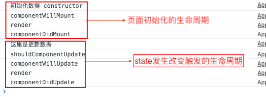
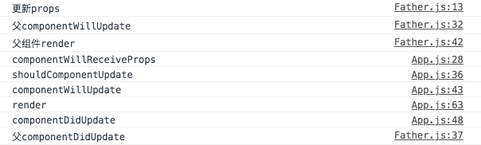
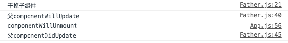

# 1 生命周期

生命周期氛围四个阶段和7个周期

* Mounting:挂在阶段
* Updating:运行阶段
* Unmounting:卸载阶段
* Error handling:错误处理阶段

8个常用的周期：

* constructor:在生命周期中首先出现的
* componentWillMount:组件将要加载的时候
* componentDidMount:组件渲染完成以后
* shouldComponentUpdate:子组件是不是应该更新，默认返回true
* componentWillUpdate:组件将要发生改变的时候
* componentDidUpdate:组件改变完成以后。
* componentWillReceiveProps:将要接受父组件传来的props
* componentWillUnmount:组件销毁的时候调用


下面是修改state触发的周期函数



下面是父组件发生改变从而改变子组件props触发的生命周期




下面是销毁子组件触发的生命周期。




# 2 组件与组件之间的传递

## 2.1 父传子

个人觉得最简单的就是父传子组件了，只要父将数据当作属性传递给子组件就可以了

```
//父
<App data={this.state.data} />
```

```
//子
<div> props:{this.props.data}</div>

```

## 2.2 子传父 

### 2.2.1 直接传 不过滤

```
//子组件

<div>请输入邮箱：<input onChange={this.props.handleEmail} /></div>
```

```
//父组件

<div>
  <div>用户邮箱：{this.state.email}</div>
  <App name="email" handleEmail={this.handleEmail.bind(this)}/>
</div>
            

 handleEmail(e){
       this.setState({email:e.target.value})
}
```
### 2.2.2 子组件将过滤后的参数传过去
