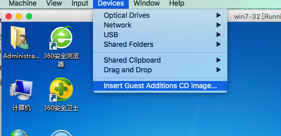
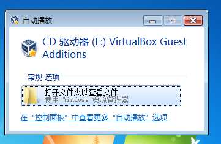
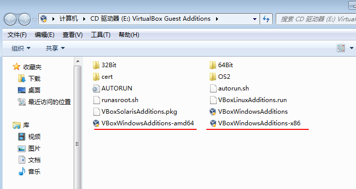

# virtualBox怎样传递文件

第一次正式的用virtualBox,主要是因为mac下没有iE浏览器，而使用测试机测试是最好的，干脆就安装一个吧。
前提是安装了虚拟机，下面是虚拟机安装windows7的步骤链接，由于这个网上百度一大堆，我就放个链接吧。
我自己用的是virtualBox5.0.10版本的。

[virtualBox安装win7系统链接](https://www.baidu.com/link?url=HQBqbZgFzaSl6xf3wTgxXEmVtC6VvcvOhI_BKM7ck4dUUhMcIfWEdicq1u_twBiVQLDuLWyVMRkZSHP3q_-tp6Kz-ychQWg8lF7GvI4knfO&wd=&eqid=cea82b0300016b26000000065b126161)

下面主要说下安装virtualBox的扩展插件来实现本机与虚拟机的互传。
下面是文件，如下图安装虚拟机上的插件。

下面就是选中你所对应版本的扩展插件啦！

安装完以后会重启的呃。