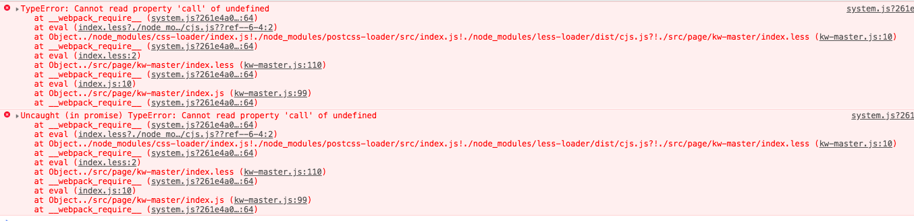
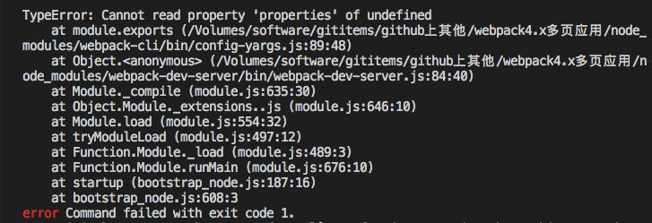
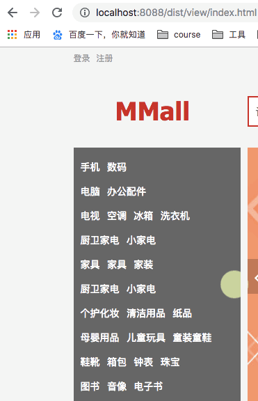

# 1. webpack4的配置问题

* [webpack3到webpack4的升级](https://www.jb51.net/article/141865.htm)
* [webpack4 spliteChunksPlugin详解](https://www.jb51.net/article/141867.htm)
* [更多高级的内容](https://github.com/wlx200510/webpack4.x-learn)

# 2. webpack升级过程中遇到的问题

1. require.ensure的时候，这个require.ensure文件的css文件被打包进入了它自己的js文件，导致程序运行的时候出现了下面的一个问题。

    
    
2. npm run dev出现了下面的错误，原因是webpack-cli的版本不匹配，最好先进行升级。



3. 完成配置了以后刷新页面，出现刚开始没有样式的情况，有可能是和css的配置有关。

    
    
    
解决方法：

```
const extractLess = new ExtractTextWebpackPlugin({
        filename: 'css/[name].css',
        allChunks: true//加上此句话即可
    })
    
    匹配css的loader处理好
```
