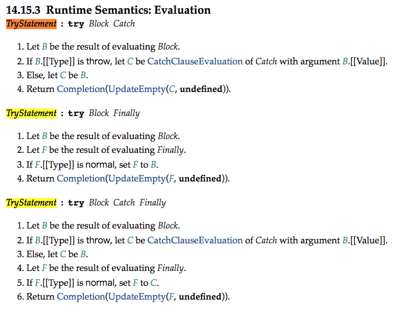

# 1. forEach和map的区别？
 * forEach返回的是undefined。map返回的是一个新数组，原数组不会发生改变
 * forEach不可以链式调用
 * 没有办法终止或跳出forEach循环的，除非报错,或者将length的长度置为0然后return
# 2. 讲下图片
    图片精灵图片，图片的也有base64,webpack里面有规定小于多少用base64图片，因为这样可以减少图片的大小
# 3. 讲下前端的性能优化手段
## 3.1 代码层面：
1. 代码进行压缩
## 3.2 网络请求层面的
1. 合并请求，合并js,css，图片等方式来减少请求
2. 域名拆分：主要是为了增加浏览器的下载的并行度，让浏览器能同时发出更多的请求
    * `主域名abc.com,`js,css和图片使用三个域名加载，分别是img.abc.com,css.abc.com,img.abc.com
3. 开启gzip压缩，可以将资源在服务端进行压缩，然后发送到浏览器后进行解压
4. 开启`keep-alive`,开启keep-alive能有效减少浏览器与服务器建立连接的次数，从而节省建立连接时间
# 4. react-virtual的实现原理，那个滚动条可以拖动是怎么来的呢？
# 5. 前端的存储方式以及区别
# 6. 说一下react框架
# 7. 怎么监控用户的行为，前端监控
# 8. js层面代码的优化
# 9. 这个的执行结果
    ```js
    try{
        return 1
    }finally{
        return 2 
    }
    ```

    我在 chrome 里面试了下,最终返回 2,我查了下 mdn 里面说 finally 如果有返回值,这个值会成为整个 try-catch-finally 的返回值.想这种直接写死的应该是直接定义在 es 规范里面的.


    额,js 的世界里有一个 es 规范,规定了 js 的方方面面,而实际执行 js 引擎则是 es 规范的实现.比如像 Chrome 的 V8,Firefox 的 JaegerMonkey.
    这些引擎如何解析和执行 js 脚本,最底层的规则就是依据 es 规范.
    规范中规定了,当 finally 有返回值时,会覆盖前面 try 中的返回值

    
# 10. typescript的枚举，泛型,interface和type的区别？
# 11. cookie,localStorage,sessionStorage在不同的页面中的表现，同时打开两个tab,这两个的表现是怎么样的