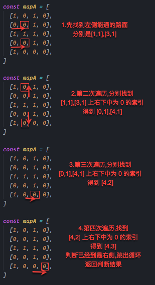

# 一面

- 讲下 进程和线程的关系 ：不停的切换，开锁和闭锁等等
- 三次握手和四次挥手
- 一个浏览器输入 url 到页面渲染这样一个完整的过程
- 讲下 react 的生命周期
- 算法题：

```js
// 在1和0构成的地图，1表示围墙，0表示路面，请实现一个函数判断一个地图，是否可以从地图的左侧走到右侧

const mapA = [
  [1, 0, 1, 0],
  [0, 0, 1, 0],
  [1, 1, 1, 0],
  [0, 0, 1, 0],
  [1, 0, 0, 0],
];

// true

const mapB = [
  [1, 1, 1, 0],
  [1, 0, 1, 0],
  [1, 0, 1, 0],
  [0, 0, 0, 1],
  [1, 0, 1, 0],
  [1, 0, 1, 0],
];

// false

function fn(map) {}
```

解题思路：


使用`while`循环解出的代码
`./code/map.js`

使用`递归`的方法解出代码

# 二面

- 一道算法 动态遍历

```js
/**
小芳在一次电商特卖双11活动中，中奖了一次特大优惠，改优惠的玩法是这样的，  给她一次优惠次数 n,  她可以把n  分成 m 使用次数 （m, n 都是整数,  n>1 且 m>1）,   
   每次使用次数记为 k[0],k[1],k[2],...,k[m].  总优惠金额等于 ((k[0] x k[1] x k[2] x ... x k[m]） x  1) 元, 请问小芳怎么才能获得最大优惠？
   例如 当优惠次数是7,  她可以把它分为 4+ 3 的使用次数，  则得到最大的优惠是（4 * 3）* 1 = 12元; 当优惠次数是8,  她可以把它分为 2 + 3 + 3 的使用次数，  则得到最大的优惠是（2 * 3 * 3）* 1 = 18元;
   
*/
```

[上面的和 leetcode 的一样](https://leetcode-cn.com/problems/integer-break/)

```js
function integerBreak(n) {
  const dp = [];
  dp[2] = [1, 1];
  dp[3] = [1, 2];
  dp[4] = [2, 2];
  dp[5] = [2, 3];
  dp[6] = [3, 3];
  for (let i = 7; i <= n; i++) {
    dp[i] = [...dp[i - 3], 3];
  }
  return dp[n];
}
```

- indexDB 的使用 内存占用的是磁盘的一半
- serviceWorker 的使用
- 你写的 eslint 是怎么检查文件是否合乎你的规定的呢，css 怎么在写的时候就确定检查的 css 文件是合乎规定的呢
- 父组件 子组件，子组件中有个 setState,我一修改会把把父组件也 render 了，那么你怎么去使得 render 的时候不修改父组件呢 `componentDidUpdate`这个生命周期
- docker images
- 页面渲染会比较卡的情况下，你怎么去不通过肉眼查看的方式知不知道比较卡， chrome 的插件`chrome-dev-tools`，performance 中的参数，`fps`
- webpack 脚手架 nodejs plugin/loader

# 三面

1.  post 和 get 是什么区别？为什么不尽量用 get
    - get 是 url，安全性不如 post
    - get 是可以缓存的，而 post 不能
    - get 多用于查询的操作，而 post 更多的用于修改
    - get 长度是有限制的，大概是 2M 左右。POST 方法没有对长度进行设置，但是服务端处理程序可以对 POST 数据大小进行限制，Tomcat 默认 2M
2.  `localStorage`和`cookie的区别`
    - `localStorage`是没有时间限制的，cookie 有
    - 大小的区别，localStorage 和 sessionStorage 的大小分别在 5M 左右，但是 cookie 大小限制在`4KB`
    - `localStorage`不会随着 http header 发送到服务器，但是是 cookie 会
    - 使用的方便性上，`localStorage`上直接提供了方法增删改查数据
3.   如何在二维数组中找到某个植，数据是从左到右，从上到下递增的情况下
        `09-找数.html`

# 不足：

- `dom diff` 手写
- `promise`手写
- `async await`查看源码
- 防抖和节流手写
- TLS 查看
- 强缓存和协商缓存
- http 和 https 的区别？
- react-hooks 原理 以及手写
- 轮播图手写
- 放大镜 随意拖动手写
- 前端监控的原理 【埋点 promise 上报 js 上报，1px 的图片支持跨域】
- 跨域的几种方式和区别 nginx devServer,
- vue 响应式原理是什么
- LRU 查看
- generator 函数 dva saga
- cors 是什么 不是浏览器的同源策略的嘛，为什么设置`access-allow-control`就行了呢
- websocket 是什么
  - 传统的 http 请求是浏览器发出请求，如果对于那种需要每隔一段时间查看结果的，则需要不断的轮训，非常消耗性能，那么 websocket 就出现了，服务器可以主动的向浏览器推送数据
  -
