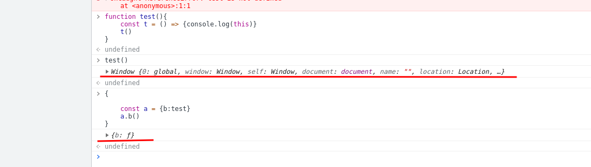

1. antd与封装好的基础库的antd冲突了，在package.json文件中加入下面的就可以了
  ```js
   "resolutions": {
    "@rider-data/rider-component/antd": "^4.15.5"
  }
  ```
2. codeMirror2与antd的Modal在第二次点击的时候会发现回填的样式出现错误，主要是由于codeMirror2本身的代码相关的问题,modal使用的时候加上`destroyOnClose`就好，具体的代码可以看下面[codemirror2代码]()

3. http1.1 pending的请求最多是多个，单是处于链接状态的最多6个
  * 我用 koa 搭了个 api，这个 api 会等待 5s 在返回，然后我在客户用 Promise.all 同时发起了 20 个请求
  * 结果现实同时只会有 6 个连接生效，其他请求都是在等待的状态
  * 我刚想到用 http2 是不是会不一样，测试了下，果然 http2 可以同时连接 20 个请求。
后面我提高数量测试了下，http2 同时连接的上限应该是在 100 。
只是暂时还不确定是 http2 的限制，当时 chrome 的限制
  * [stackoverflow上回答](https://stackoverflow.com/questions/62477498/how-to-get-around-browsers-6-concurrent-connections-per-domain-limit)
  

4. 某天在react项目的全局中使用了一个this.graph，刚开始是空对象，后面通过异步获取到this.graph之后由于他不是存在store中，那么就调用this.render(),发现在
  ```js
  render(){
    console.log(this.graph,Object.keys(this.graph)) //这里的this.graph，以及Object.keys的内容发生了变化，但是你在return的页面中显示的时候还是没有发生变化
    return(
      <div>{Object.keys(this.graph)}</div>//这里并没有发生变化，数量还是0
    )
  }
  ```

  React 是一个框架，他会有自己的一些规则在里面，只有按照他的规则来，才能得到想要的结果。（当然，如果你足够了解底层，知道这么操作的可以的获得想要的结果，那也可以）
  如果你知道手动去调用 render 能获得你想要的结果，那就可以这么去操作。而如果你不知道这么操作的结果，那就最好不要这么做

  说回你这代码，像你这样不按照生命周期来，那就很容易出现意外。这就是 bug，平常开发就都很累的，就没必要给自己增加负担了。
5. try,catch,finally的问题,问你最后返回的是那个？[js执行语句理解方式](https://blog.csdn.net/liuhua_2323/article/details/102893840)
  ```js
  try(){
    return 1
  }catch{
    return 2
  }
  finally{
    return 3
  }
  ```
  之前讨论过关于在 finally 语句中 return 的问题，当时我是根据规范中的说明去解释这个现象的。
  今天发现可以从 JS 语句执行机制这个角度去理解这个现象。
  这个角度比规范上单调的文字说明更容易理解，同时也能加深对 JS 执行过程的理解。
  具体可以看看下面这篇文章
6. 遇到的关于this的问题
  * 像这里，t 没有自己的 this，而是取决于它定义的的作用域，也就是 test 的作用域，第一次是直接调用 test 所以这时候 test 的 this 是 window， t 也跟着是 window，第二次将 test 作为 a 对象的一个属性，然后使用 a.b 这种方式调用，test 的 this 就变成了 a 对象，t 的 this 也跟着变成 a 对象
  
  * 用作用域只是为了方便理解，只是刚好箭头函数的外层 this 的范围和外层作用域的范围一致。
    另外作用域和上下文是两个东西，作用域是词法阶段的，上下文是执行阶段。
  * js里面所有的操作可以理解为入栈和出栈，栈执行完了之后会被清理，除非是用了闭包被占用了，this的指向在其中栈中的某一层

  * 如过某个项目中构建的类的时候使用了 本来是用在原型上的方法使用了箭头函数，导致this不可用，那么可以使用下面这种方式实现deepClone
    ```js
      this.copyBoxObj = _.cloneDeepWith(copyObject, oldObj => {
          if (
            typeof oldObj === 'object' &&
            'toRenderFormat' in oldObj &&
            typeof oldObj.toRenderFormat === 'function'
          ) {
            const newObj = new oldObj.constructor()
            for (const key in oldObj) {
              if (Object.hasOwnProperty.call(oldObj, key)) {
                const element = oldObj[key]
                if (typeof element !== 'function') {
                  newObj[key] = _.cloneDeep(element)
                }
              }
            }
            return newObj
          }
        })
    ```
7. 遇到新版本的浏览器版本 `92.0.4515.107（正式版本） （64 位）`里面 SharedArrayBuffer不能使用的问题
  * 我了解了下，是因为使用 SharedArrayBuffer 的过程中，发现了一个 CPU 级的漏洞，在可见的未来不太可能修复。需要跨域隔离来保障安全。 是关于新版本 Chrome 需要开启严格跨域才能用 SharedArrayBuffer ，但是这个的实践好像并没与用法

8. 遇到了需要部署matomo的情况，在部署的过程中需要用到服务器还有各种的环境，发现docker真是好用，下面是zhenyan推荐的
[php 和nginx的复合的镜像](https://hub.docker.com/r/trafex/php-nginx)
```js
docker run --rm -p 8080:8080 -v /var/www/html/matomo:/var/www/html trafex/php-nginx //映射matomo那个文件夹到container中的/var/www/html中
//然后打开localhost:8080查看网页，按照一步一步来操作


```
[一篇matomo部署的文章](https://qing.su/article/164.html)